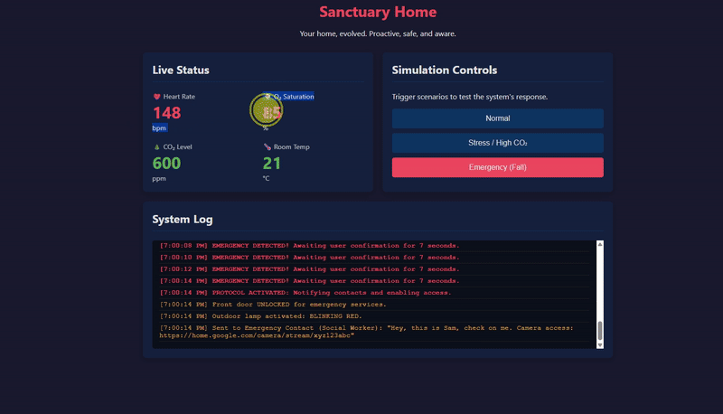

# Sanctuary Home

*Your home, evolved. Proactive, safe, and aware.*

---

## 🚀 Live Demo & Video Presentation

| Live Application                                      | Video Walkthrough                                 |
| ----------------------------------------------------- | ------------------------------------------------- |
| [**Click here to run the live demo**](https://sanctuary-home.onrender.com) | [**Click here to watch the video**](https://youtu.be/8fAsc9a29UA) |

*(Please allow 15-30 seconds for the free server to wake up on the first visit.)*

### Quick Look


---

## The Problem

Every year, thousands of people, especially the elderly, disabled, or those living alone, face emergencies at home without the ability to call for help. A fall, a sudden medical issue, or an accident can become fatal when every second counts and the home remains a silent witness. Traditional smart homes react to commands, but they cannot react to a silent crisis.

## Our Solution: Sanctuary Home

**Sanctuary Home** transforms the smart home from a set of convenient gadgets into a proactive life-saving guardian. By integrating real-time biometric data from standard wearables (heart rate, SpO2) with the Google Home ecosystem, our platform enables a home to truly understand its resident's well-being.

-   **Proactive Comfort:** The system senses your stress or poor air quality through your vitals and automatically adjusts the environment for you.
-   **Autonomous Emergency Protocol:** In case of a fall or a medical emergency, the system detects the anomaly and triggers a life-saving protocol: unlocking the door for first responders, activating visual alerts, and notifying trusted contacts with camera access.

We are turning every home into a guardian, especially for the most vulnerable among us.

---

## Google Home API Integration

This project is designed to deeply integrate with the Google Home ecosystem, leveraging its powerful APIs. While this MVP simulates the API calls for a clear demonstration, the backend logic is built to directly interface with the following Google Home APIs and device traits.

### 1. Core APIs and Device Traits Utilized

Our system interacts with smart devices by sending commands targeting specific [device traits](https://developers.home.google.com/traits).

-   🚪 **Emergency Access:** `action.devices.traits.LockUnlock`
    -   **Purpose:** To grant immediate access to emergency services.
    -   **Interaction:** The backend sends an `unlock` command to the front door lock.

-   🚨 **Visual Alerting:** `action.devices.traits.OnOff` & `action.devices.traits.ColorSetting`
    -   **Purpose:** To activate a highly visible outdoor lamp as a beacon.
    -   **Interaction:** The system turns the lamp on and sets its color to emergency red.

-   👁️ **Remote Monitoring:** `action.devices.traits.CameraStream`
    -   **Purpose:** To provide a trusted contact with a live view to assess the situation.
    -   **Interaction:** The system requests a secure, temporary stream URL from an indoor camera and sends it to a pre-authorized contact.

-   쾌 & 🌡️ **Proactive Comfort:** `action.devices.traits.FanSpeed` & `action.devices.traits.TemperatureSetting`
    -   **Purpose:** To automatically improve air quality and adjust temperature based on user's stress markers.
    -   **Interaction:** The system triggers commands to ventilation systems and thermostats to create a more comfortable environment.

### 2. API Interaction Flow: The Emergency Protocol

**Diagram:**
`[Wearable Data] -> [Sanctuary Home Backend] -> [Google Home API] -> [Smart Devices]`

**Step-by-step:**
1.  **Data Ingestion & Anomaly Detection:** The backend analyzes the user's biometric data stream.
2.  **Protocol Trigger:** A pattern consistent with a fall (e.g., SpO2 < 90% & HR > 120 bpm) initiates the Emergency Protocol countdown.
3.  **Multi-Device API Command Execution:** If not cancelled, the backend executes a sequence of concurrent commands via the Google Home API (`POST /v1/devices:execute`) targeting the lock, lamp, and camera traits.
4.  **External Notification:** The system retrieves the camera stream URL from the API response and immediately sends it to the emergency contact, completing the life-saving loop.

---

## How to Run Locally

### Prerequisites
- [Node.js](https://nodejs.org/) (which includes npm)
- [Git](https://git-scm.com/)

### Installation & Launch
1.  **Clone the repository:**
    ```bash
    git clone https://github.com/aura-emowise/google-home-dev-challenge.git
    ```
2.  **Navigate to the project directory:**
    ```bash
    cd google-home-dev-challenge
    ```
3.  **Install dependencies:**
    ```bash
    npm install
    ```
4.  **Start the server:**
    ```bash
    npm start
    ```
5.  **Open your browser** and go to `http://localhost:3000`.